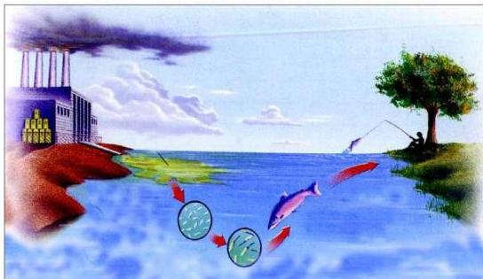

# الكيمياء والبيئة

# Chemistry and the environment

# الوحدة التاسعة

# الأهداف

نتوقع منك بعد الانتهاء من دراسة هذه الوحدة أن تكون قادراً على أن:

١ - تشرح مفهوم البيئة.
٢ - توضح المقصود بالتلوث والملوثات.
٣ - تكتب المعادلات الكيميائية الموزونة والمعبرة عن تلوث الهواء الناجم عن استخدام مصادر الطاقة المختلفة.
٤ - توضح الآثار الناتجة عن تلوث الأرض.
٥ - تميز بين ملوثات الماء، الهواء، والتربة. مع ذكر الأمثلة.
٦ - تبين الأضرار الناتجة عن تلوث المياه والتربة.
٧ - تبين المشاكل الناجمة عن التلوث في البيئة التي نعيش فيها.
٨ - توضح الحلول المقترحة للحد من تلوث البيئة.
٩ - تساهم في التوعية ووضع المقترحات المناسبة للحد من التلوث في البيئة المحيطة.

١٦٧

http://www.e-learning-moe.edu.ye/