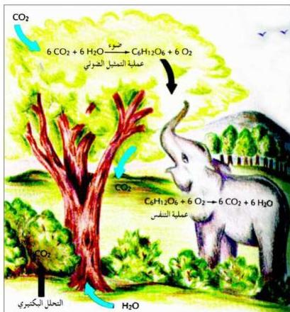

## مفهوم البيئة

البيئة هي الوسط الذي نعيش فيه ونتفاعل معه سلباً أو إيجاباً، وتتكوّن من عدة عناصر هي الأرض التي نعيش عليها ونتمتّع بخيراتها ومواردها، وكذلك الهواء الذي نتنفسه، والمياه التي نشربها، وكل هذه العناصر في تفاعل ديناميكي مستمر وتوازن يحفظ الحياة على الأرض.

والتوازن القائم بين مختلف عناصر البيئة توازن دقيق، ويمكن ملاحظته في كثير من الأشياء التي تقع حولنا، فيمكن أن نرى هذا التوازن في دورة الكربون، حيث يقوم النبات بامتصاص غاز ثاني أكسيد الكربون من الهواء ويستخدمه لصنع غذائه

شكل (٩-١) دورة الكربون

وينطلق الأكسجين كناتج ثانوي، وتقوم بعض عناصر البيئة باستخدام الأكسجين في عملياتها الحيوية للحصول على الطاقة وهي بدورها تطلق غاز ثاني أكسيد الكربون، ... وهكذا، شكل (٩-١).

١٦٨

http://www.e-learning-moe.edu.ye/