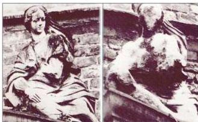

## الآثار الناجمة عن تلوث الهواء :

### ١- المطر الحمضي Acid Rain :

في الآونة الأخيرة بدأت تظهر بعض الظواهر الغريبة في العالم الصناعي مثل اختفاء الأسماك في البحيرات الكبيرة، وتعرض الكثير من التماثيل والمنحوتات التي ظلت صامدة لآلاف السنين للتلف والتشوه السريع، وكذلك انحسار الغابات الشائعة، وموت النباتات الصغيرة، وكان المتهم بظهور مثل هذه الظواهر ما يطلق عليه اسم المطر الحمضي. وكما نعرف أن قيمة الرقم الهيدروجيني (pH) لماء المطر تساوي ٥.٦ ولكن ما الذي يجعل هذا المطر حامضياً؟

هناك العديد من ملوثات الهواء والتي ذكرناها سابقاً ( $\text{NO}$ , $\text{SO}_2$ , $\text{CO}_2$ ) تجعل قيم الرقم الهيدروجيني (pH = 3) منخفضة عن طريق تفاعلاتها مع جزيئات الماء.

$$\begin{aligned} \text{CO}_2 + \text{H}_2\text{O} & \longrightarrow \text{H}_2\text{CO}_3 \\ \text{SO}_2 + \text{H}_2\text{O} & \longrightarrow \text{H}_2\text{SO}_3 \\ \text{SO}_3 + \text{H}_2\text{O} & \longrightarrow \text{H}_2\text{SO}_4 \\ 2\text{NO}_2 + \text{H}_2\text{O} & \longrightarrow \text{HNO}_3 + \text{HNO}_2 \end{aligned}$$

وكما نرى فإن نواتج هذه الملوثات ( $\text{NO}_2$ , $\text{SO}_3$ , $\text{SO}_2$ , $\text{CO}_2$ ) مع الماء هي حموض وهي تسبب خفض قيمة الرقم الهيدروجيني لماء المطر.

وعندما تسقط مثل هذه الأمطار الحمضية على البحيرات فإنها تعمل على خفض قيمة الرقم الهيدروجيني لهذه البحيرات أيضاً مؤدية إلى موت الأسماك في هذه البحيرات.

شكل (٩-٤) تأثير المطر الحمضي على التمثال

أما تأثير المطر الحمضي على التماثيل والمنحوتات فيرجع إلى أن المطر الحمضي يتفاعل مع كربونات الكالسيوم الموجودة في حجارة هذه التماثيل مكوناً كبريتات الكالسيوم الذائبة في الماء، كما في الشكل (٩-٤).

$$\text{H}_2\text{SO}_4 + \text{CaCO}_3 \longrightarrow \text{CaSO}_4 + \text{H}_2\text{O} + \text{CO}_2$$

١٧٦

<http://www.e-learning-moeg.edu.ye/>