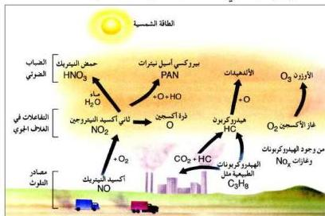

ويرجع انحسار الغابات إلى أن المطر الحمضي يزيد من ذوبانية بعض العناصر الموجودة في التربة في صورة غير ذائبة. فعلى سبيل المثال، الحمض الهيدروجيني الموجودة في المطر الحمضي يتفاعل مع هيدروكسيد الألومينيوم الموجودة في التربة في صورة غير ذائبة حاملاً الألومينيوم في صورة ذائبة (أيونات الألومينيوم) مُسهلاً بذلك دخوله إلى جذوع النباتات مُسبباً تأثيرات سُمِّيَّة عليها.

$$\text{Al}(\text{OH})_3 + 3\text{H}^+ \longrightarrow \text{Al}^{3+} + 3\text{H}_2\text{O}$$

# ٢ - ظاهرة الضباب الدخاني Smong:

هناك ظاهرة جلية في المدن المزدحمة بالسكان والسيارات، فالزيادة في عدد السيارات ترافقها زيادة في الوقود المحترق في محركاتها مثل (السولار أو الجازولين)، وهذا الاحتراق لا يكون تاماً على الدوام، لذا فإن غازات العادم التي تتكون من $\text{CO}_2$ والماء تكون مصحوبة بكميات قليلة من المركبات الهيدروكربونية التي لم تتآكسد أكسدة تامة، إضافة إلى أول أكسيد الكربون وبعض أكاسيد النيتروجين.

وهذا الخليط الغازي السام المنطلق من عشرات الآلاف من السيارات يتعرض للأشعة فوق البنفسجية المنبعثة من الشمس. ونظراً لاحتواء هذا الخليط على غاز ثاني أكسيد النيتروجين الذي يمتص الأشعة فوق البنفسجية، ويتفكك (كما ذكرنا سابقاً) إلى أول أكسيد النيتريك والأكسجين الذري، حيث يتفاعل الأكسجين الذري مع جزيئات الأكسجين لتكوين الأوزون والذي يدخل في سلسلة من التفاعلات مع الهيدروكربونات النشطة والموجودة في هذا الخليط، ونتيجة لهذه التفاعلات

شكل (٩-٥) ظاهرة الضباب الدخاني

الكيميائية الضوئية يتكون ما يُسمّى بالضباب الدخاني (Smog) الذي يبقى معلقاً في الهواء ويغلف جوّ المدينة مسبباً احتقان الأغشية المخاطية وحرق العيون ويشير

١٧٧

http://www.e-learning-moe.edu.ye/