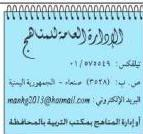

## أسئلة عامة، أجب بـ (نعم) أو (لا):

|  البند | نعم | لا  |
| --- | --- | --- |
|  - ينسجم محتوى الكتاب مع نظام الفصلين الدراسيين . |  |   |
|  - عدد الحصص المقررة تكفي لا يستيعاب مادة الكتاب . |  |   |
|  - هل الوسائل التعليمية متنوعة وكافية ؟ |  |   |
|  - هل هناك ضرورة لوجود قائمة بالمراجع ومصادر المعلومات ؟ |  |   |
|  - هل هناك موضوعات ترى ضرورة حذفها (اذكرها) ؟ |  |   |
|  - هل هناك موضوعات ترى ضرورة إضافتها (اذكرها) ؟ |  |   |
|  إذا كان لديك ملاحظات أخرى اكتبها ...  |   |   |
|  ...  |   |   |
|  ...  |   |   |
|  ...  |   |   |
|  ...  |   |   |

## قائمة الأخطاء العلمية واللغوية والمطبعة:

|  الخطأ | الصفحة | السطر | الصواب  |
| --- | --- | --- | --- |
|  |   |   |   |
|  |   |   |   |
|  |   |   |   |
|  |   |   |   |
|  |   |   |   |
|  |   |   |   |
|  |   |   |   |
|  |   |   |   |
|  |   |   |   |
|  |   |   |   |
|  |   |   |   |
|  |   |   |   |
|  |   |   |   |
|  |   |   |   |

نرى التكرم بإرسال الاستبيان إلى

١٩١

http://www.e-learning-moe.edu.ye/