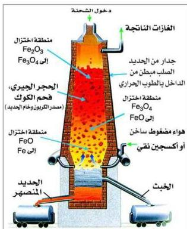

شكل (١-١) الفرن العالي (اللافح)

– وتؤدي كمية الحرارة المرتفعة المتولدة في هذا القسم من الفرن إلى رفع درجة الحرارة إلى ما يقارب ١٩٠٠م، وفي أثناء تصاعد الغازات الساخنة يتفاعل $CO_2$ مع كميات إضافية من الكربون في تفاعل ماص للحرارة ليكون أول أكسيد الكربون الذي يعتبر عامل الاختزال الفعال في الفرن.

$$CO_2 + C \longrightarrow 2CO \quad \Delta H = +173 \text{ Kj}$$

وتحدث عملية اختزال خام الحديد في سلسلة من الخطوات، انظر الشكل (١-١) نجد أنه بقرب قمة الفرن يتم اختزال $Fe_2O_3$ إلى $Fe_3O_4$، كما في المعادلة الآتية:

$$3Fe_2O_3 + CO \longrightarrow 2Fe_3O_4 + CO_2$$

وإلى أسفل من ذلك بقليل، في منطقة أكثر حرارة من الفرن، يختزل $Fe_3O_4$ إلى $FeO$، حسب المعادلة الآتية:

$$Fe_3O_4 + CO \longrightarrow 3FeO + CO_2$$

وأخيراً تختزل $FeO$ إلى الفلز تحت المنطقة السابقة – أيضاً – ويكون الفلز عند درجات الحرارة العالية منصهراً، فينساب إلى الأسفل مكوناً بركة من الفلز المصهور في قاعدة البرج.

$$FeO + CO \longrightarrow Fe + CO_2$$

ووظيفة الحجر الجيري في الفرن تتمثل في تزويد وسط قاعدي تتفاعل معه الأكاسيد الحمضية، مثل: $SiO_2$ و $P_2O_5$، أو الأكاسيد الأمفوتيرية مثل $Al_2O_3$.

١٨

<http://www.e-learning-moe.edu.ye/>