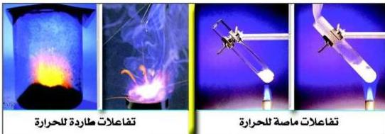

e-learning

# الطاقة الحرارية المصاحبة لتغيرات المادة
(الكيمياء الحرارية Thermochemistry)

# الوحدة الثانية

# الأهداف

نتوقع منك بعد الانتهاء من دراسة هذه الوحدة أن تكون قادراً على أن:

١ - تشرح العلاقة بين الطاقة الكيميائية وبقية صور الطاقة.
٢ - تُفرِّق بين السعة الحرارية والحرارة النوعية.
٣ - تُطبِّق قانون الحرارة النوعية في الحسابات الكيميائية الحرارية.
٤ - تكتب معادلات تُبيِّن التغيرات الحرارية للعمليات الكيميائية والفيزيائية.
٥ - تُوضِّح معنى حرارة التفاعل وعلاقتها بالمحتوى الحراري.
٦ - تُفرِّق بين التفاعلات الطاردة والماصة للحرارة.
٧ - تُوضِّح المقصود بحرارة التكوين، وحرارة الاحتراق، وحرارة التعادل، وحرارة الذوبان، وحرارة التكثيف.
٨ - تحسب التغيرات الحرارية باستخدام حرارة التكوين القياسية.
٩ - تُطبِّق قانون هس في الحسابات الحرارية الكيميائية.

٢٢

http://www.e-learning-moe.edu.ye/