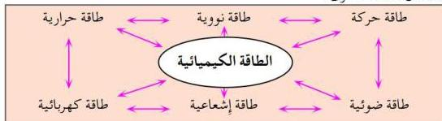

## مقدمة

من المعلوم أن الطاقة توجد بأشكال عدة منها: الحرارية، والميكانيكية والكهربائية، والضوئية، والكيميائية، والاختلاف في أشكال الطاقة قد يوحي بأن كل شكل مستقل بذاته، إلا أن ذلك غير صحيح؛ لأنه يمكننا تحويل الطاقة من شكل إلى آخر. فمثلاً الطاقة الكيميائية المخزونة في وقود السيارات (خليط من المركبات الهيدروكربونية) جازولين يمكن تحويلها إلى طاقة ضوئية أو حركية. وهذا يقودنا إلى استنتاج أن الطاقة لا تفنى ولا تستحدث، وإنما تتحول من شكل إلى آخر، وهذا ما نص عليه القانون الآتي.

**قانون بقاء الطاقة:** ينصُّ على أن الطاقة لا تفنى ولا تستحدث ضمن قدرة المخلوق، ولكن يمكن نقلها من مكان إلى آخر، أو تحويلها من شكل إلى آخر.

## صور الطاقة وتحولاتها:

يوضح الشكل (٢-١) بعضاً من تحولات الطاقة وعلاقة الطاقة الكيميائية بأشكال الطاقة الأخرى.

شكل (٢-١) صور الطاقة وتحولاتها

- من الشكل السابق تتضح أهمية الطاقة الكيميائية، وضح ذلك.
- هل يمكنك من خلال الشكل (٢-١) توضيح قانون بقاء الطاقة؟
في دراستنا لهذه الوحدة سوف تتضح العلاقة بين الطاقة الكيميائية والطاقة الحرارية.
**الطاقة الكيميائية:** هي طاقة مخزونة ضمن الوحدات التركيبية للمواد الكيميائية، لذلك تُسمَّى «طاقة الوضع الكيميائية»، وتختلف كمية الطاقة المخزونة في أي مادة طبقاً لنوع الذرات الداخلة في تركيب المادة ونظام ترتيبها.
فوقود السيارات يحتوي على كمية كبيرة من طاقة الوضع الكيميائي، بينما لا يحتوي الماء على القدر نفسه من الطاقة.

- ما العلاقة بين نوع الذرات الداخلة في تكوين مركبي الماء والجازولين وبين الطاقة الكيميائية المخزونة في كل منهما؟

٢٣

http://www.e-learning-moe.edu.ye/