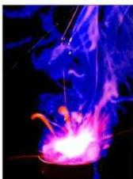
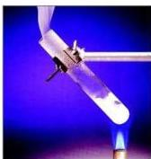

شكل (٢-٢)
تفاعل البوتاسيوم مع الماء

شكل (٢-٣) تحلل نيترات
الأمونيوم بالحرارة

عرفت في دراستك السابقة أهمية الطاقة للإنسان
وكيف أن علم الكيمياء يسهم إسهاماً كبيراً في دراسة
التغيرات الكيميائية وما يصاحبها من تغيرات في الطاقة،
حيث أن هناك تغيرات كيميائية تحدث نتيجة للتفاعل
بين الذرات أو الجزيئات، وتكون مصحوبة إما بامتصاص
أو انطلاق طاقة حرارية، ومثال ذلك تفاعل البوتاسيوم مع
الماء والذي يكون مصحوباً بانطلاق كمية من الحرارة
والضوء، كما هو موضح في الشكل (٢-٢).

- اكتب معادلة تفاعل البوتاسيوم مع الماء موضحاً
سبب الاشتعال الذي يحدث أثناء التفاعل.

لعلك أدركت من خلال دراستك السابقة أن هناك
بعض التفاعلات التي لا يمكن أن تحدث إلا عند امتصاص
كمية من الحرارة، ومثال ذلك: تحلل نيترات الأمونيوم
(NH₄NO₃) إلى غاز أكسيد النيتروز (N₂O) وبخار
الماء، كما هو موضح في الشكل (٢-٣).

- اكتب معادلة التفاعل التي توضح انحلال نترات
الأمونيوم بالحرارة.

وسوف يتم دراسة بعض العلاقات بين صور الطاقة في وحدات أخرى من هذا الكتاب.

الكيمياء الحرارية: هو العلم الذي يهتم بدراسة التغيرات الحرارية المصاحبة
للتغيرات الكيميائية والفيزيائية.

- ما علاقة حدوث التفاعل الكيميائي بالطاقة؟

للإجابة عن هذا السؤال يمكنك الرجوع إلى ما سبق لك دراسته من تفاعلات
كيميائية في المراحل السابقة، وستلاحظ أن معظم التفاعلات الكيميائية تكون
مصحوبة بتغيرات في الطاقة، حيث إن أغلب التفاعلات الكيميائية تكون إما طاردة
للحرارة، أو ماصة لها. ففي حالة التفاعلات الطاردة للحرارة تنتقل الطاقة من النظام
(System) إلى الوسط المحيط، بينما نجد أنه في التفاعلات الماصة للحرارة يقوم النظام
بامتصاص الطاقة من الوسط المحيط.

٢٤

http://www.e-learning-moe.edu.ye/