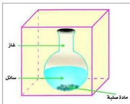

## ولكن ما المقصود بكل من النظام والوسط المحيط؟

النظام (System): هو جزء معين من الكون محدود بحدود معينة قد تكون حقيقية أو تخيلية.

الوسط المحيط: وهو ذلك الجزء المتبقي خارج حدود النظام.

شكل (٢-٤) يوضح النظام

الشكل (٢-٤) يعطي مثالاً للنظام والذي يمثل أحد التفاعلات الكيميائية التي حدثت داخل الدورق.

- ما عناصر هذا النظام؟

- ما حدود هذا النظام؟

- ما الوسط المحيط بهذا النظام؟

إذا حدث تغير في النظام الموضح في الشكل (٢-٤)، بحيث أن الحرارة لا يمكن نقلها عبر الحدود الفاصلة بين النظام والوسط المحيط به، فإننا نسمي هذه العملية (عملية أديباتية، Adiabatic) ومثال ذلك التفاعل الذي يحدث في وعاء معزول حرارياً.

ومن الممكن أن نحفظ النظام في درجة حرارة معينة أثناء حدوث التغير، وفي هذه الحالة تسمى العملية (أيزو ثيرمي، Isothermal).

تسمى المتغيرات الفيزيائية للنظام والتي يمكن ملاحظتها أو قياسها خواص النظام، مثل: الحجم، والضغط، ودرجة الحرارة. وبتحديد خواص النظام، يمكن تحديد حالته؛ فإذا كانت قيم خواص النظام لا تتغير مع الزمن، فإن النظام يكون في حالة اتزان.

### العلاقة بين الحرارة ودرجة الحرارة:

تعتبر الحرارة (Heat) أحد أشكال الطاقة، ويمكن أن تنتقل الطاقة على هيئة حرارة من النظام أو إليه عبر عملية التوصيل الحراري، أو عبر عملية الإشعاع الحراري.

∴ الحرارة: طاقة تنتقل من جسم إلى آخر نتيجة للاختلاف في درجة حرارة الجسمين، وتنتقل الحرارة تلقائياً من المادة الأعلى إلى الأقل في درجة الحرارة، وتقاس بوحدات الطاقة، وهي الجول.

٢٥

http://www.e-learning-moe.edu.ye/