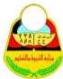
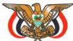

الجمهورية العربية

وزارة التربية والتعليم
قطاع المناهج والتوجيه
الإدارة العامة للمناهج

# الكيمياء

## للصف الثالث الثانوي

### فريق التأليف

أ.د. داؤود عبدالملك الحدابي / رئيساً.

أ.د. علي جمعان الشكيل. د. مهيوب علي أنعم.
د. عبد الولي حسين دهمش. د. محسن عبدالله الجهري.
أ/عمر فضل بافضل.

### فريق المراجعة:

أ. وحيد عبد العالم محمد. أ. طلال عبده مقبل الشوافي.
أ. سلامة حسن جابر.
تنسيق وتدقيق: أ / محمد علي ثابت.

### الإخراج الفني

|  الصور والرسوم: | محمد حسين الدماري.  |
| --- | --- |
|  أرسـلان الأغـبـري. | عبد السلام أحمد الحبيبي.  |
|  الصف والتصميم: | بسام أحمد العامر.  |
|  إدخال التصويبات: | أحمد محمد علي العوامي.  |
|   | علي عبد الله السلفي.  |

أشرف على التصميم: حامد عبد العالم الشيباني.

١٤٣٨هـ - ٢٠١٧م

http://www.e-learning-moe.edu.ye/