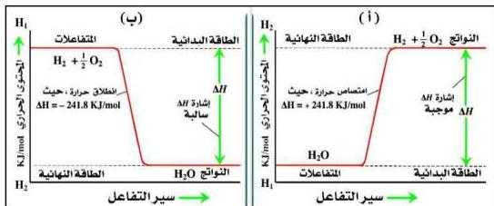

وللتعرف على مفهوم التفاعلات الطاردة والماصة للحرارة، يمكن تتبُّع المثال الآتي:

■ مثال:

عند إشعال مولين من غاز الهيدروجين مع مول واحد من الأكسجين عند درجة حرارة الغرفة يتكون مولان من بخار الماء وتنطلق كمية من الطاقة مقدارها ٤٨٣,٦ كيلو جول، وفقاً للمعادلة الآتية:

$$2\text{H}_{2(\text{g})} + \text{O}_{2(\text{g})} \longrightarrow 2\text{H}_2\text{O}_{(\text{g})} \quad \Delta H = - 483.6 \text{ KJ}$$

وإشارة $\Delta H$ السالبة تعني أن هذا التفاعل طارد للحرارة، وكمية الحرارة المطلقة تعتمد على كمية المتفاعلات والنواتج، وبالتالي فإن إنتاج مول واحد من بخار الماء يتطلب تفاعل مول واحد من الهيدروجين مع نصف مول من الأكسجين. ويصاحب هذه العملية انبعاث كمية من الحرارة مقدارها ٢٤١,٨ كيلوجول/مول، وفقاً للمعادلة الآتية:

$$\text{H}_{2(\text{g})} + \frac{1}{2} \text{O}_{2(\text{g})} \longrightarrow \text{H}_2\text{O}_{(\text{g})} \quad \Delta H = - 241.8 \text{ KJ/mole}$$

وعلى العكس فإن تفكُّك مول واحد من الماء يعتبر ماصاً للحرارة وفقاً للمعادلة الآتية:

$$\text{H}_2\text{O}_{(\text{g})} \longrightarrow \text{H}_{2(\text{g})} + \frac{1}{2} \text{O}_{2(\text{g})} \quad \Delta H = + 241.8 \text{ KJ/mole}$$

ويوضِّح الشكل (٢-٥) التغيُّر في المحتوى الحراري للتفاعلات الماصة والطاردة للحرارة.

شكل (٢-٥) التفاعل الماص، والطارد للحرارة

٢٩

http://www.e-learning-moe.edu.ye/