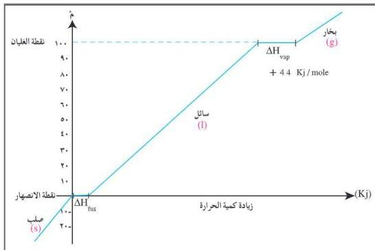

ب) حرارة التبخير والتكثيف Heat of Vaporization and Condensation:
عرفت سابقاً أن الماء المتجمد (الثلج) يتحوّل إلى سائل عند امتصاصه لكمية من الحرارة، وعند استمرار التسخين يبدأ السائل بالغليان ويتحوّل السائل إلى بخار ماء، ويوضّح الشكل (٢-٦) منحنى التسخين للماء.
ويمكن استخدام المعادلة الحرارية الآتية لوصف عملية تحوّل الماء السائل لبخار.

$$\text{H}_2\text{O} \xrightarrow{\text{(l)}} \text{H}_2\text{O} \quad \Delta\text{H} = +44 \text{ KJ/mole}$$
للتبخير

شكل (٢-٦) منحنى تسخين الماء ابتداء من الحالة الصلبة إلى الحالة الغازية

من خلال الشكل (٢-٦):

- ماذا يحدث لدرجة الحرارة عند نقطة الانصهار وعند نقطة الغليان؟
- أي عمليات التحوّل تحتاج إلى درجة حرارة عالية، تحويل كمية من الثلج إلى سائل، أم تحويل الكمية نفسها من سائل إلى غاز؟
- اكتب المعادلة الحرارية التي تعبّر عن تحوّل بخار الماء إلى سائل موضحاً قيمة $\Delta H$.
- هل عملية التكثيف ماصّة أم طاردة للحرارة؟

٣٢

http://www.e-learning-moe.edu.ye/