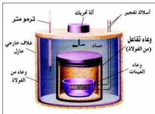

**وتعرّف حرارة الاحتراق القياسية بأنها:** كمية الحرارة المطلقة عند احتراق مول واحد من المادة احتراقاً تاماً في وجود كمية وافرة من الأكسجين أو الهواء الجوي عند ٢٥م، وتحت ضغط يعادل الضغط الجوي المعتاد.

### ملاحظة

تحترق معظم العناصر الفلزية واللافلزية مع الأكسجين، وينتج عن ذلك تكون الأكاسيد، بينما تحترق المركبات العضوية الختوية على الكربون والهيدروجين أو الكربون والهيدروجين والأكسجين، وينتج عن ذلك تكون ثاني أكسيد الكربون وبخار الماء.

ويمكن كتابة المعادلة الكيميائية الحرارية التي تعبّر عن احتراق بعض المواد في وجود الأكسجين على النحو الآتي:

$$H_{2(g)} + \frac{1}{2} O_{2(g)} \longrightarrow H_2O_{(l)}, \Delta H_C = -285.9 \text{ KJ/mole}$$

$$C_{(s)} + O_{2(g)} \longrightarrow CO_{2(g)}, \Delta H_C = -393.5 \text{ KJ/mole}$$

$$CH_3CH_2CH_3_{(g)} + 5O_{2(g)} \longrightarrow 3CO_2 + 4H_2O_{(l)}, \Delta H_C = -2219.2 \text{ KJ/mole}$$

$$CH_3OH_{(l)} + \frac{3}{2} O_{2(g)} \longrightarrow CO_2 + 2H_2O_{(l)}, \Delta H_C = -726.6 \text{ KJ/mole}$$

### قياس حرارة الاحتراق (المسعر الحراري)

تقاس حرارة الاحتراق لكثير من المواد بدقة باستخدام مسعرات خاصة مثل مسعر القنبلة الموضح في الشكل (٢-٧)، حيث يجري التفاعل باستخدام كميات معلومة

شكل (٢-٧) مسعر القنبلة

من المادة المراد حرقها مع كمية وافرة من الأكسجين تحت ضغط (١ جو) وتكون موضوعة في وعاء معزول من الصلب يُسمّى بوعاء التفاعل (القنبلة)، ويتم إشعال المادة باستخدام سلك كهربائي، ويحاط وعاء التفاعل بكمية موزونة من الماء.

٣٤

<http://www.e-learning-moe.edu.ye/>