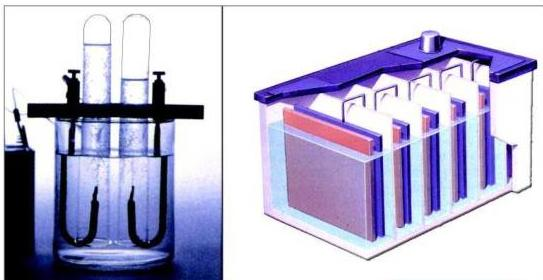

# الطاقة الكهربائية و تفاعلات الأكسدة والاختزال

## الوحدة الثالثة

### الأهداف

نتوقع منك بعد الانتهاء من دراسة هذه الوحدة أن تكون قادراً على أن :

١ - تُعرّف التاكسد والاختزال وفقاً للنظرية الإلكترونية.
٢ - تميّز بين العوامل المؤكسدة والعوامل المختزلة.
٣ - توضّح المقصود بعدد التاكسد.
٤ - تحسب أعداد التاكسد للذرات في الصيغ المختلفة.
٥ - تصنّف الخلايا الكهروكيميائية.
٦ - توضّح مزايا السلسلة الكهروكيميائية.
٧ - تذكر أنواع الخلايا الجلفانية.
٨ - تشرح التفاعلات الحادثة في المركم الرصاص.
٩ - تقارن بين الخلية الجلفانية والخلية الإلكترونية.
١٠ - توضّح بعض التطبيقات على التحليل الكهربائي للمحاليل ومصاهر الأملاح.
١١ - تُطبّق قانوناً فارادياً في حل المسائل المتعلقة بهما.
١٢ - تعطي أمثلة للتفاعلات غير المرغوبة للتاكسد.

٤٢

http://www.e-learning-moe.edu.ye/