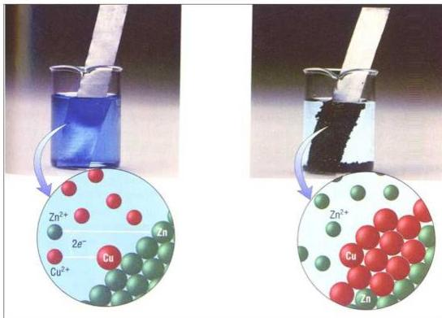

## الخلايا الكهروكيميائية Electrochemical Cells

تتضمَّن تفاعلات الأكسدة والاختزال انتقال الإلكترونات من المادة التي تأكسدت إلى المادة التي اختزلت، وإذا كانت المادة المختزلة والمؤكسدة على اتصال، صاحب انتقال الإلكترونات طاقة حرارية.

شكل (١-٣) الخلايا الكهروكيميائية

الشكل (١-٣) يظهر ساقاً من الزنك (الخارصين) موضوعة في محلول من كبريتات النحاس، ونتيجة لهذا الاتصال يفقد الزنك إلكترونات تنتقل إلى أيونات النحاس الموجودة في المحلول والتي تكتسبها وتترسب على شكل ذرات نحاس في قاع الإناء وتصاحب عملية انتقال الإلكترونات بين النحاس والزنك انطلاق طاقة على هيئة حرارة.

أما إذا فصلنا بين المادة المتأكسدة والمادة المختزلة فإن انتقال الإلكترونات يكون مصحوباً بانطلاق طاقة كهربية بدلاً عن الطاقة الحرارية.

وقد توضع المادة المتأكسدة والمادة المختزلة في إناء واحد ويُفصَّل المحلولان الإلكتروليتان عن بعضهما بواسطة حاجز مسامي، وقد توضع المادتان في إنائين منفصلين ويتصلان بواسطة قنطرة ملحية تسمح بمرور الأيونات بين المحلولين.

٤٧

http://www.e-learning-moe.edu.ye/