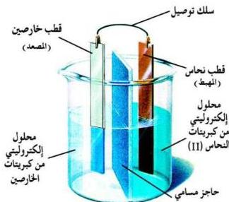

## نشاط (١-٣)

نفذ النشاط الذي يوضّح تفاعل الأكسدة والاختزال التلقائي.

تركيب الخلية الكهروكيميائية:

تتكون الخلية الكهروكيميائية من نصفي خلية، كل نصف به قطب مغمور جزئياً في محلول إلكتروليتي، وأحد القطبين يُسمّى مصعداً والآخر مهبطاً يتّصلان بسلك موصل، انظر الشكل (٢-٣).

شكل (٢-٣) خلية كهروكيميائية

والتفاعل الذي يجري في الخلية الكهروكيميائية قد يكون مصحوباً بانطلاق طاقة كهربائية، وعندئذ تسمّى خلية جلفانية Galvanic Cell، وقد يكون التفاعل مصحوباً باستهلاك طاقة كهربائية، وعندئذ تسمّى خلية التحليل الكهربي «الخلية الإلكترونية».

## أولاً: الخلايا الجلفانية

عبارة عن خلايا كهروكيميائية يحدث فيها تفاعل أكسدة واختزال تلقائي ويكون هذا التفاعل مصحوباً بتوليد طاقة كهربائية.

ويمثّل الشكل (٣-٣) خلية جلفانية تحتوي على الخارصين والنحاس وتتكون من الآتي:
١ - نصف خلية الخارصين ($zn / zn^{2+}$): وتتكون من وعاء به لوح خارصين مغمور جزئياً في محلول مائي من كبريتات الخارصين (ويطلق عليه المصعد) وتحدث فيها عملية الأكسدة.

$$Zn_{(s)} \longrightarrow Zn_{(aq)}^{2+} + 2e^-$$

٤٨

http://www.e-learning-moe.edu.ye/