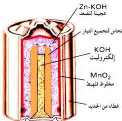
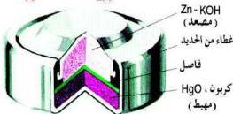

عند الكاثود : $2\text{NH}_4^+ + 2\text{e}^- + 2\text{MnO}_2 \longrightarrow 2\text{MnO}(\text{OH}) + 2\text{NH}_3\uparrow$
ويكون التفاعل الكلي كما يلي :

$$\text{Zn} + 2\text{MnO}_2 + 2\text{NH}_4^+ \longrightarrow \text{Zn}^{+2} + 2\text{MnO}(\text{OH}) + 2\text{NH}_3\uparrow$$

شكل (٣-٧) الخلية القاعدية

ب - الخلية (البطارية) القاعدية : هذا النوع من الخلايا أطول عمراً وأصغر حجماً، ولا يحتوي على عمود الكربون (الجرافيت) ونستخدم بدلاً عنه عجينة من فلز الخارصين وهيدروكسيد البوتاسيوم (KOH)، ويعمل ثاني أكسيد المنجنيز $\text{MnO}_2$ كاثوداً (مهبطاً).

تفاعلات الخلية :

$$\text{Zn}_{(s)} + 2\text{OH}^- \longrightarrow \text{Zn}(\text{OH})_2 + 2\text{e}^-$$

$$2\text{MnO}_2 + \text{H}_2\text{O} + 2\text{e}^- \longrightarrow \text{Mn}_2\text{O}_3 + 2\text{OH}^-_{(aq)}$$

$$\text{Zn}_{(s)} + 2\text{MnO}_{2(s)} + \text{H}_2\text{O} \longrightarrow \text{Zn}(\text{OH})_2 + \text{Mn}_2\text{O}_{3(s)}$$

شكل (٣-٨) خلية الزئبق

ج - خلية (بطارية) الزئبق : تتميز بصغر حجمها وتستخدم في الآلات الحاسبة ومقويات السمع، ويكون الأنود (المصعد) فيها عجينة الخارصين مع هيدروكسيد البوتاسيوم كما في البطارية القاعدية، إلا أن

الكاثود (المهبط) هنا يكون أكسيد الزئبق، والقوة الناتجة عنها تساوي ١,٣ فولت.

تفاعلات الخلية :

$$\text{Zn}_{(s)} + 2\text{OH}^-_{(aq)} \longrightarrow \text{ZnO}_{(s)} + \text{H}_2\text{O} + 2\text{e}^-$$

$$\text{HgO} + \text{H}_2\text{O} + 2\text{e}^- \longrightarrow \text{Hg} + 2\text{OH}^-_{(aq)}$$

$$\text{Zn}_{(s)} + \text{HgO}_{(s)} \longrightarrow \text{ZnO}_{(s)} + \text{Hg}_{(l)}$$

٥٥

http://www.e-learning-moe.edu.ye/