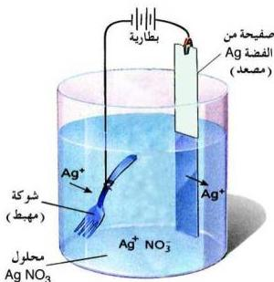

شكل (٣-١٢) الطلاء بالكهرباء

$$Ag^+ + e^- \longrightarrow Ag_{(s)}$$
$$Ag_{(s)} \longrightarrow Ag^+ + e^-$$
عند الكاثود ( المهبط )
عند الأنود ( المصعد )

قانون فارادي للتحليل الكهربائي :

قام العالم فارادي عام ١٨٣٢م باكتشاف العلاقة بين كمية الكهرباء المارة في المحلول أو المصهور وكمية المواد المتكوّنة عند الأقطاب، ولخّص هذه العلاقة في قانونين سُمّيا باسمه .

قانون فارادي الأول : « تتناسب كتل المواد المتكوّنة عند أي قطب أثناء عملية التحليل الكهربائي تناسباً طردياً مع كمية الكهرباء المارة في المحلول أو المصهور » .

$$Ag^+ + e^- \longrightarrow Ag_{(s)}$$
لو نظرنا إلى المعادلة الآتية :

نلاحظ أن مولاً واحداً من الإلكترونات ( ٢٢٠٥ × ١٠٣) إلكتروناً يتفاعل مع أيونات الفضة ليرسب مولاً واحداً من الفضة ( ١٠٧,٨٨ جم )، وبالمثل فإن تفاعل مولين من الإلكترونات يرسب مولين من الفضة ... وهكذا .

ويطلق على كمية الكهرباء اللازمة لخلية إلكتروليتية للحصول على مول واحد من الإلكترونات لإحداث تفاعل أكسدة أو اختزال اسم الفارادي .

١ فارادي = ١ مول من الإلكترونات .

٦٣

http://www.e-learning-moe.edu.ye/