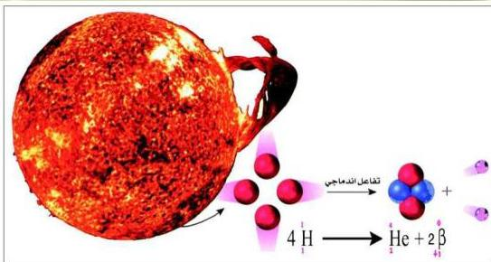

# الطاقة والتفاعلات النووية
Nuclear Reactions and Energy

# الوحدة الرابعة

# الأهداف

نتوقع منك بعد الانتهاء من دراسة هذه الوحدة أن تكون قادراً على أن:

١ - تُوضِّح المقصود بالنواة.
٢ - تقارن بين التفاعلات الكيميائية والنووية.
٣ - تُعرِّف النظائر وأنواعها، وتُحدِّد علاقاتها بالتفاعلات الكيميائية.
٤ - تُفسِّر العلاقة بين متوسط طاقة الترابط النووي واستقرار النواة.
٥ - تُفسِّر سبب حدوث التفاعلات النووية.
٦ - تكتب المعادلات الموزونة التي تُعبِّر عن التفاعلات النووية.
٧ - تُوضِّح أنواع التفاعلات النووية والعوامل المؤثرة على نواتجها.
٨ - تُوضِّح تفاعلات التحلُّل الإشعاعي وتأثيرها في النواة.
٩ - تُحدِّد أهم الفروق بين الإشعاعات المختلفة والمبعثة من الأنوية غير المستقرَّة.
١٠ - تقارن بين تفاعلي الانشطار والاندماج النووي.
١١ - تذكر أهم الاستخدامات المفيدة والضارة للتفاعلات النووية.

٦٩

http://www.e-learning-moe.edu.ye/