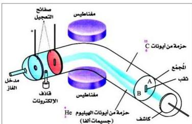

## اكتشاف النظائر

وجد العلماء أن التشابه في الخواص الكيميائية لذرات العنصر الواحد يدلّ على أن هذه الذرات تحمل الشحنة نفسها؛ بمعنى أنها تملك عدداً ذرياً واحداً.

ولكن هل ذرات العنصر الواحد متساوية الكتلة؟

حاول العلماء البحث عن إجابة لهذا التساؤل، وقد استندوا على الفرضية التي تقول بأن الذرة غير قابلة للانقسام، وهذا يستدعي بأن تكون الكتل الذرية لجميع العناصر عبارة عن أعداد صحيحة. ولكن عند قياس الكتل الذرية لبعض العناصر بطرق دقيقة لوحظ أنها عبارة عن قيم كسرية، فمثلاً الكتلة الذرية للأكسجين (١٥,٩٩٩٤)، والبورون (١٠,٨١١).

وقد حاول العلماء إيجاد تفسير منطقي لوجود الكسور في الأعداد الكتلية للعنصر الواحد، وقادهم ذلك إلى الافتراض أن ذرات العنصر الواحد قد لا تكون متساوية في الكتلة.

شكل (٤-١) مطياف الكتلة

ولذلك بدأ التفكير بإيجاد طريقة لفصل الذرات على أساس اختلاف كتلتها، وقد تمكّن آستون As-ton عام ١٩١٩م من بناء أول جهاز لفصل الذرات، وسُمّي بمطياف الكتلة

(Mass Spectrometer)، وتمّ تطويره وتزويده بأجهزة أكثر حساسية على يد العالم «بين بردج Bain Bridge» عام ١٩٢٣م، كما يوضّحه الشكل (٤-١). وباستخدام هذا الجهاز وأجهزة أخرى، تمكّن العلماء من التعرّف على عدد نظائر العنصر الواحد، وكذلك إيجاد كتلة كل نظير، ومن ثمّ الوصول إلى تفسير سبب وجود الكسور في الكتل الذرية للعناصر.

٧١

http://www.e-learning-moe.edu.ye/