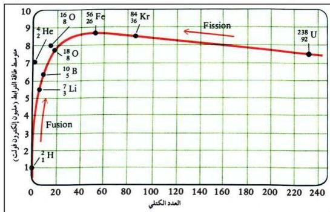

## استقرار النواة

من خلال العرض السابق يتضح لك أن هناك علاقة بين طاقة الترابط واستقرار النواة، حيث لوحظ أنه كلما كانت طاقة الترابط عالية؛ كانت النواة أكثر ثباتاً واستقراراً. وللتعرّف على مدى استقرار الأنوية المختلفة للعناصر، يتم حساب متوسط طاقة الترابط النووي، والتي تُمثّل في المعادلة الآتية:

$$\text{متوسط طاقة الترابط النووية} = \frac{\text{طاقة الترابط النووية}}{\text{عدد النيوكليونات}}$$

ولحساب متوسط طاقة الترابط لنواة الهيليوم، يتم تحويل وحدة الطاقة من الجول إلى وحدة المليون إلكترون فولت.

حيث إن: ١ مليون إلكترون فولت = ١٠ × ١,٦٠٢١٧٧ جول.

$$\therefore \text{طاقة الترابط} = \frac{10 \times 4,54}{10 \times 1,60217} = 28,3 \text{ مليون إلكترون فولت}$$

$$\therefore \text{متوسط طاقة الترابط لنواة الهيليوم} = \frac{28,3}{4} = 7,075 \text{ مليون إلكترون فولت}$$

ويوضح الشكل (٤-٢) متوسط طاقة الترابط لبعض الأنوية والعدد الكتلي.

شكل (٤-٢) طاقة الترابط

٧٦

http://www.e-learning-moe.edu.ye/