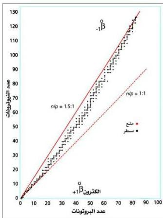

٣ - الأنوية التي يكون عددها
الذري أكبر من (٨٣)
تكون غير مستقرة،
لوقوعها بعد حزام
الاستقرار.

٤ - الأنوية التي تقع أعلى
حزام الاستقرار تكون
فيها نسبة $\frac{n}{p}$ أكبر من
حالة الاستقرار، لذلك
تميل إلى إطلاق
جسيمات (بيتا)
للوصول إلى حالة
الاستقرار. ويظهر
الشكل (٤-٣) أيضاً أن
الأنوية التي تقع أسفل
حزام الاستقرار تكون

شكل (٤-٣) حزام الاستقرار

فيها نسبة $\frac{n}{p}$ أقل من حالة الاستقرار؛ لذلك تميل الأنوية الثقيلة إلى إطلاق
جسيمات (ألفا $\infty$ )، والخفيفة إلى إطلاق البوزيترون أو أسر إلكترون.

كما توصل العلماء والباحثون إلى ملاحظات أخرى، هي:

- الأنوية التي يكون عدد البروتونات فيها مساوياً لأحد هذه الأرقام (٢، ٨،
٢٠، ٢٨، ٥٠، ٨٢) تكون مستقرة.

- الأنوية التي يكون عدد النيوترونات فيها مساوياً أحد هذه الأرقام (٢، ٨،
٢٠، ٢٨، ٥٠، ٨٢، ١٢٦) تكون مستقرة أيضاً.

- الأنوية التي تملك أعداداً زوجية من البروتونات والنيوترونات فإنها في معظم
الحالات تكون مستقرة.

# ملاحظة

تسمى الأرقام (٢، ٨، ٢٠، ٢٨، ٥٠، ٨٢، ١٢٦) بالأرقام السحرية.

٧٨

http://www.e-learning-moe.edu.ye/