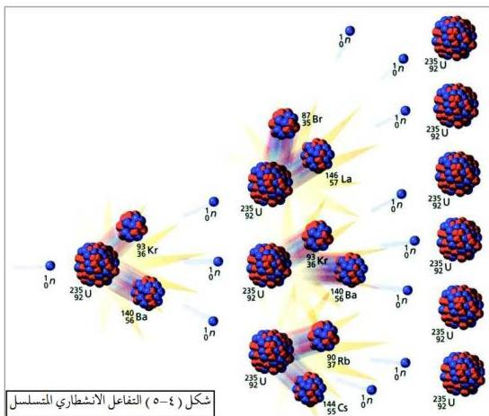

### تطبيقات على التفاعلات الانشطارية:

هناك تطبيقات عديدة على التفاعلات الانشطارية، فبعضها نافع وبعضها ضار ومدمّر للبيئة والكائنات الحية بشكل عام. ومن التطبيقات السلمية والهامة للتفاعلات الانشطارية هو استخدام المفاعلات النووية لإنتاج الطاقة الكهربائية، ولتحلية مياه البحر، ولإنتاج النظائر المشعة التي تستخدم في مجالات عديدة.

وحسب ما هو واضح في الشكل (٤-٦)، فإن المفاعل النووي يتكوّن من خمس مكونات أساسية، هي:

١ - الدرع الواقي: وهو عبارة عن معدن سميك، أو خرسانة مُسلّحة تحيط بالمفاعل؛ ليمنع تسرب الإشعاعات خارج المفاعل.
٢ - مُبرّد: مثل الماء أو مصهور الصوديوم؛ لامتصاص الحرارة الناتجة عن التفاعل - حتى لا تنصهر القضبان - وللاستفادة من هذه الحرارة في إنتاج بخار الماء لتشغيل المولدات الكهربائية.
٣ - قضبان التحكم: تُصنع من مادة الكادميوم أو البورون أو الكوبلت ووظيفتها

٨٤

http://www.e-learning-moe.edu.ye/