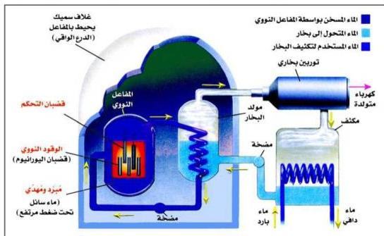
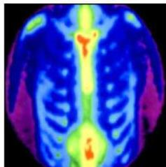

التحكُّم في حدوث التفاعلات النووية عن طريق امتصاص النيوترونات والسيطرة على سرعة وشدة التفاعل، كما تستخدم لإيقاف المُفاعل عن العمل.

٤ - المُهَدِّي: المواد النقية تعتبر أفضل المواد المهدئة، ويستخدم الجرافيت أو الماء الثقيل كمُهَدِّي لإبطاء سرعة النيوترونات.

٥ - الوقود النووي: عبارة عن عدد من قضبان اليورانيوم النقي الذي يحتوي على ٣-٤٪ يورانيوم (٢٣٥) قابل للانشطار، والباقي يورانيوم (٢٣٨).

شكل (٤-٦) رسم توضيحي للمفاعل النووي المستخدم لإنتاج الطاقة الكهربائية

شكل (٤-٧) يوضح استخدام العناصر المشعة لتشخيص سرطان العظام

من فوائد المفاعلات النووية:

١ - إنتاج النظائر المُشعَّة التي لها استخدامات عديدة.
٢ - توليد الطاقة الكهربائية.
٣ - تحلية مياه البحر.

فوائد النظائر المُشعَّة:

في مجال الطب: هناك العديد من التطبيقات الإيجابية للنظائر المُشعَّة، ومنها:
- يستخدم التكنيتيوم - ٩٩ لتشخيص سرطان العظام، انظر الشكل (٤-٧).

٨٥

http://www.e-learning-moe.edu.ye/