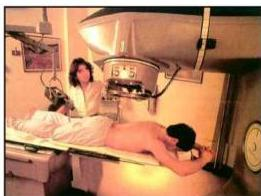

شكل (٤-٨) علاج السرطان بالأشعة

- يستخدم اليود المشع في تشخيص وعلاج أمراض الغدة الدرقية.
- يستخدم نظير الراديوم المُشع في علاج أمراض السرطان، شكل (٤-٨).
- يستخدم نظير الفوسفور المشع في علاج سرطان الدم.
- يستخدم الكوبالت المشع في علاج السرطان بالإشعاع.

ومن التطبيقات السلبية لتفاعل الانشطار النووي هو إنتاج القنبلة الذرية.
حيث تعتمد فكرة القنبلة النووية على انشطار أنوية اليورانيوم $^{235}_{92}$ أو البلو تونيوم $^{239}_{94}$، بأخذ كتلة معينة من اليورانيوم أو البلو تونيوم، وتعريضها فجأة لضغط كبير يؤدي إلى انكماشها إلى حجم أصغر، ويحدث نتيجة لذلك انشطار في الأنوية بطريقة تلقائية وتنطلق كمية كبيرة من الطاقة.

ج- الاندماج النووي (Nuclear Fusion): هو تفاعل نووي يتم فيه دمج نواتين صغيرتين لتكوين نواة أكبر. وهذا النوع من التفاعلات يعتبر أخطر من تفاعلات الانشطار النووي، وذلك نتيجة لكمية الطاقة الهائلة التي تنتج من هذا التفاعل.

ومن أمثلة هذا التفاعل اندماج أنوية الهيدروجين (ديوتيريوم $^{2}_{1}$، تريتيريوم $^{3}_{1}$) لتكوين نواة الهيليوم، كما في المعادلة الآتية:

$$\text{حارة عالية} + \text{H}^2 + \text{H}^3 \xrightarrow{\text{حرارة عالية}} \text{He}^4 + \text{n}^1 + \text{طاقة هائلة}$$

خلق الله سبحانه وتعالى الشمس وجعلها مصدراً مهماً للطاقة الحرارية، ولولا وجود هذه الطاقة لما كانت الحياة ممكنة على سطح الأرض.

فما مصدر هذه الطاقة الهائلة التي تصلنا من الشمس؟

التفاعل الاندماجي في الشمس:
يحدث التفاعل الاندماجي في الشمس نتيجة لوجود حرارة شديدة تسمح باندماج أربعة أنوية من الهيدروجين $^{1}_{1}$، كما في المعادلة الآتية:

$$4 \text{H}^1 \xrightarrow{\text{نويترون}} \text{He}^4 + 2 \beta^+ + 1$$

انظر الشكل في بداية الوحدة.

٨٦

http://www.e-learning-moe.edu.ye/