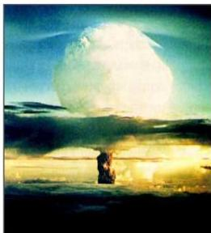

## تطبيقات على التفاعلات الاندماجية:

للأسف الشديد لم يتمكن الإنسان حتى الآن من تطويع التفاعل الاندماجي لإنتاج الطاقة لمنفعة الإنسان. إلا أن هناك تطبيقات سلبية مدمرة تتمثل في إنتاج القنبلة الهيدروجينية.

شكل (٤-٩) انفجار القنبلة الهيدروجينية

وتعتمد القنبلة الهيدروجينية على تفاعل الاندماج النووي.

وتتكون القنبلة الهيدروجينية من قنبلتين إحداهما انشطارية نووية بداخل غلاف قوي جداً، والأخرى عبارة عن القنبلة الهيدروجينية التي تتكون من أنوية الهيدروجين الثقيل وهي موجودة في وعاء يحيط بالقنبلة الانشطارية.

ويبدأ تفجير القنبلة الانشطارية أولاً، ومن ثم يستفاد من الحرارة الناتجة

عن هذا التفاعل في اندماج أنوية الهيدروجين لتكوين أنوية الهيليوم، وانطلاق كمية هائلة من الطاقة لها قدرة تدميرية أكبر بكثير من القوة التدميرية الناتجة عن انفجار القنبلة النووية؛ حيث تعادل قوة انفجار القنبلة الهيدروجينية (١٠٠٠) قنبلة ذرية، أو ما يعادل انفجار (٢٠) مليون طن من مادة (T.N.T.).

## الوقاية من خطر التلوث الإشعاعي

نظراً للمخاطر الكبيرة التي يمكن أن يتعرض لها الإنسان نتيجة للتلوث الإشعاعي، فإن المنظمات والهيئات العلمية قد أصدرت العديد من التعليمات والإرشادات الواجب اتخاذها عند التعامل مع المواد المشعة، أو عند حدوث تلوث إشعاعي نتيجة للحوادث، ومن أهم احتياطات السلامة والأمان ما يأتي:

### أولاً: احتياطات الأمان في المعامل أو المفاعلات النووية:

ومن هذه الاحتياطات ما يلي:

١ - حفظ وتغليف المواد المشعة في مغلفات مزدوجة خاصة بها، وكتابة بعض المعلومات المهمة عليها.

٨٧

http://www.e-learning-moe.edu.ye/