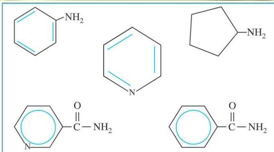

# مركبات النيتروجين العضوية
Organic Nitrogen Compounds

# الوحدة الخامسة

# الأهداف

نتوقع منك بعد الانتهاء من دراسة هذه الوحدة أن تكون قادراً على أن:

١ - تُعرّف كلاً من الأمينات والأميدات والحمض الأميني.
٢ - تُصنّف الأمينات إلى أولية، وثانوية، وثالثية.
٣ - تُحدّد الخواص الفيزيائية للأمينات.
٤ - تميّز العلاقة بين الأمينات والأميدات والحموض الأمينية من خلال الصيغة العامة.
٥ - تُسمّى الأمينات والأميدات والأحماض الأمينية.
٦ - تكتب الصيغ البنائية لبعض مركبات النيتروجين العضوية الهامة.
٧ - تُوضّح كيف تحضر مركبات الأمينات والأميدات.
٨ - تُبيّن التفاعلات الكيميائية للأمينات والأميدات والحموض الأمينية.
٩ - تُصنّف الحموض الأمينية طبقاً لوجود مجموعة الأمين ومجموعة الكربوكسيل.
١٠ - تُفرّق بين الحموض الأمينية المختلفة.

٩١

http://www.e-learning-moe.edu.ye/