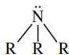
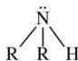
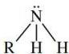
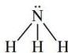

يوجد النيتروجين في كثير من المركبات العضوية، والمركبات ذات العلاقة بالعمليات الحيوية في الكائنات الحية. وفي هذه المركبات يتحد النيتروجين مع بعض العناصر الأخرى مكوناً مجموعات فاعلة، فمثلاً يتحد مع الكربون مكوناً مجموعة السيانيد (CN)، ومع الأكسجين مكوناً مجموعة النيترو (NO₂)، كما يتحد مع الهيدروجين مكوناً مجموعة الأمينو (NH₂).

وتتكون أصناف لا حصر لها من المركبات العضوية المحتوية على النيتروجين باتحاد هذه المجموعات (CN, NO₂, NH₂) مع الهيدروكربونات الأليفاتية والأروماتية.

وستتعرض هنا لدراسة بعض هذه المركبات، وهي:

١ - الأمينات.
٢ - الأميدات.
٣ - النيتريلات والحموض الأمينية.

## أولاً: الأمينات: Amines

الأمينات هي مجموعة من المركبات العضوية التي تحتوي على الكربون والهيدروجين والنيتروجين فقط، وهي بذلك تُعد مشتقات للأمونيا؛ حيث تستبدل ذرة هيدروجين أو ذرتين أو ثلاث في جزيء الأمونيا بمجموعة الكيل أو أريل وبعد ذلك نحصل على أصناف الأمينات الثلاثة. (R هي مجموعة الكيل أو أريل).

أمين ثالثي (3)
Tertiary Amine

أمين ثانوي (2)
Secondary Amine

أمين أولى (1)
Primary Amine

أمونيا (نشادر)

## التسمية: Nomenclature

تُسمى الأمينات إما بأن نذكر أسماء المجموعات المتصلة بذرة النيتروجين متبوعة بكلمة «أمين»، أو بأن نعتبر ذرة النيتروجين وما تحمله مجموعة بديلة على المركب ويمكن اعتبارها الطريقة الأعم لأنها الوحيدة التي تصلح لتسمية مركب لا نجد لإحدى مجموعاته تبسيطاً، ومن أمثلة ذلك ما يأتي:

٩٢

http://www.e-learning-moe.edu.ye/